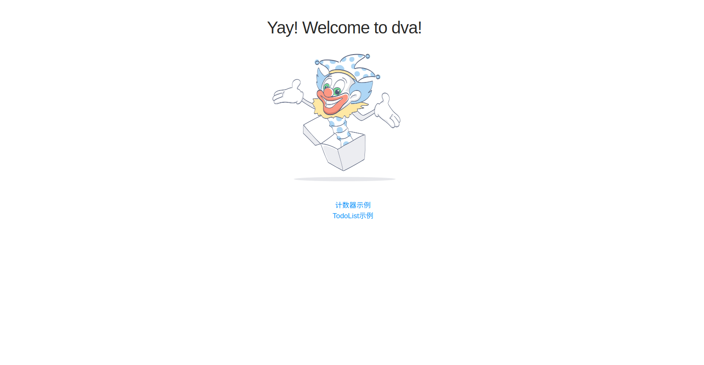
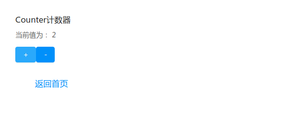
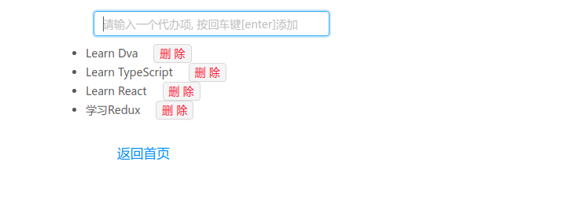
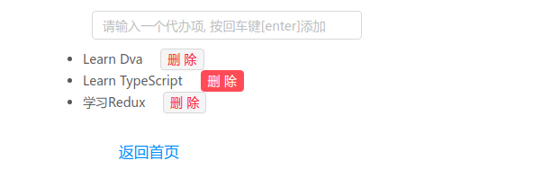

# 使用 Dvajs 开发示例 demo 合集

### 项目安装

```shell
yarn install 
# 或者
npm install
```


### 项目运行

```sh
yarn start
# 或者
npm run start
```

> 如果运行出错，  请将 `package.json` 中的启动命令； 去掉 **PORT=3000**  


### 项目效果图










